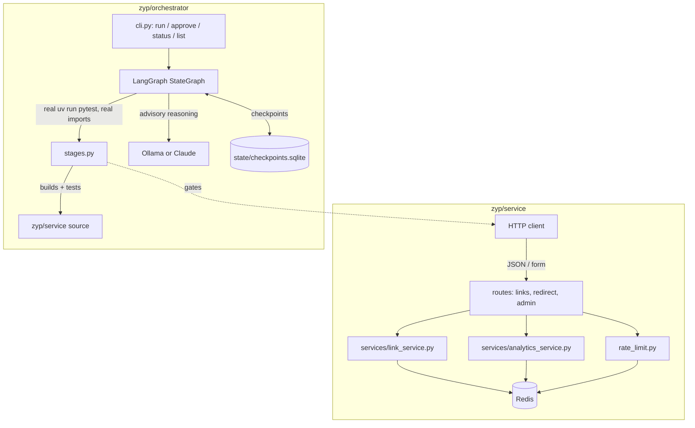

# zyp

A URL shortener built on Python/Flask + Redis, paired with a LangGraph-based agentic SDLC
orchestration engine that builds and gates it — a standalone sibling project to sLink (the
original Java/Spring Boot/H2 shortener + stdlib-orchestrator project), built to demonstrate the
same "critical differentiator" (real agentic SDLC orchestration, not narrated) with a different
stack and a real agent framework.

- **What this is and how the pieces fit together**: this README (architecture below)
- **The service in detail**: [`service/README.md`](service/README.md) — API reference, Redis data
  model, design tradeoffs
- **The orchestrator in detail**: [`orchestrator/README.md`](orchestrator/README.md) — LangGraph
  mechanics, configurable model/RAG/policy, what's verified for real

## Why this exists

Zyp and sLink are two independent implementations of the same product idea, each paired with its
own orchestration engine:

| | sLink | zyp |
|---|---|---|
| Service stack | Java 17 / Spring Boot / H2 / JPA | Python / Flask / Redis |
| Orchestrator | stdlib `graphlib.TopologicalSorter` engine | LangGraph `StateGraph` |
| Human approval | file-based approval store, polled | `interrupt()` + `SqliteSaver` checkpointer |
| Model in the loop | none — fully deterministic | configurable (local Ollama by default, Claude optional) for two advisory reasoning steps |

Both are real, complete projects — not one canonical version with a reskin. Redis forces
different data-modeling decisions than JPA/SQL (sorted sets instead of `ORDER BY`, atomic
counters instead of sequences, incremental structures instead of aggregation queries), and
LangGraph's `interrupt()`/checkpointer is a genuinely different mechanism for the same
human-in-the-loop requirement a hand-rolled file-based store solves in sLink. Building both, on
purpose, is the point — it's a comparison, not a migration.

## Architecture



The orchestrator's deterministic stages run real commands against the service directory
(`uv run pytest`, real Python module imports, a real static-analysis scan) — it builds and tests
the actual code in this repo, not a simulation of it. Two stages additionally get LLM-driven
reasoning layered on top (ambiguity analysis on the requirements doc, advisory code review after
static analysis passes) — but the LLM never decides pass/fail; the real tool output does.

## Quick start

Requires [uv](https://docs.astral.sh/uv/) and a local Redis (`brew install redis`).

```bash
cd service
./start.sh                          # checks Redis + port, runs in the foreground
```

- Swagger UI: http://localhost:5000/swagger-ui
- Admin UI: http://localhost:5000/admin (`admin` / `zyp@123` by default)

```bash
curl -X POST http://localhost:5000/api/v1/links \
  -H "Content-Type: application/json" -d '{"originalUrl":"https://example.com"}'
curl -i http://localhost:5000/<code>   # 302 redirect
```

Run the service's own tests (40 tests, ~97% coverage):

```bash
cd service && uv run pytest tests/ --cov=. --cov-report=term-missing
```

### The orchestrator

```bash
cd orchestrator
./setup.sh                          # installs Ollama + pulls a local model, syncs the Python env
uv run python cli.py run --scenario greenfield
```

If it blocks on the approval gate before `release_readiness`:

```bash
uv run python cli.py approve <run_id> --by "Your Name" --decision approve
uv run python cli.py run --scenario greenfield --run-id <run_id>   # resumes
```

To use Claude instead of the local model, set `model_provider: anthropic` in
`orchestrator/config.yaml` with `ANTHROPIC_API_KEY` set — see `orchestrator/README.md`.

## Repo layout

```
zyp/
  service/            the Flask + Redis app (uv-managed)
  orchestrator/        the LangGraph SDLC engine that builds and gates it (uv-managed)
  scenarios/            greenfield/ — requirements, design, and documentation artifacts the
                         orchestrator's stages gate against
```

## What's verified for real, not just written

A live `orchestrator run --scenario greenfield` genuinely: imports the actual service modules as
its "compile" check, runs the actual `pytest` suite (unit + integration) and parses real JUnit XML
and coverage JSON, runs a real static-analysis scan against the actual source, blocks at a real
`interrupt()`, resumes from a **separate process** reconnecting to the same sqlite checkpoint
file after a real `approve` command, and finishes with a real coverage-gated `pytest` run standing
in for a release check. See `orchestrator/README.md` for the specifics of one such run.
