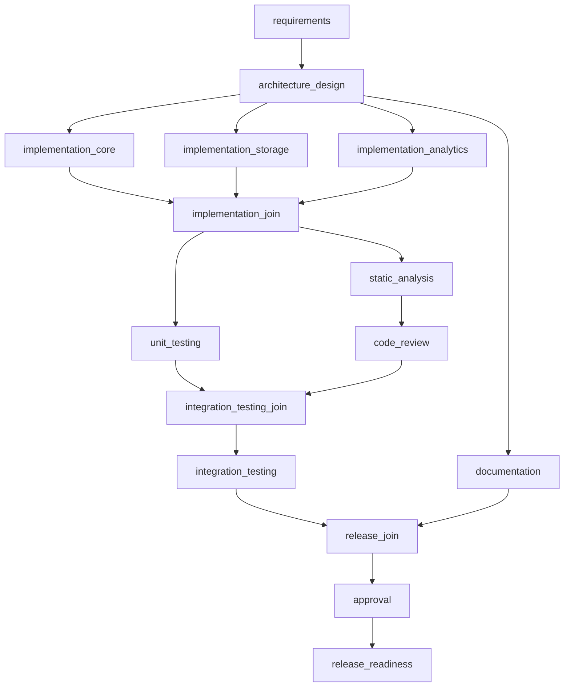

# zyp

A URL shortener built on Python, FastAPI, and Redis, paired with an SDLC orchestration engine built
on [LangGraph](https://github.com/langchain-ai/langgraph) that builds and gates it: real command
execution, real test results, real human approval checkpoints, and configurable LLM-assisted
reasoning layered on top of — never substituting for — deterministic verification.

- **Service details**: [`service/README.md`](service/README.md) — API reference, Redis data model
- **Orchestrator details**: [`orchestrator/README.md`](orchestrator/README.md) — scenario runs,
  configuration reference

## Components

| Component | Path | Responsibility |
|---|---|---|
| Link service | `service/services/link_service.py` | Create, read, update, soft-delete, and list short links |
| Analytics service | `service/services/analytics_service.py` | Record clicks; aggregate totals, daily counts, top referrers/user-agents, recent activity |
| Rate limiter | `service/rate_limit.py` | Fixed-window request limiting on link creation |
| HTTP layer | `service/routes/`, `service/app.py` | REST API (FastAPI + Pydantic), redirect endpoint, admin UI |
| Orchestration graph | `orchestrator/graph.py` | The SDLC stage graph: parallel execution, retry routing, approval gate |
| Stage executors | `orchestrator/stages.py` | The real commands each stage runs against `service/` |
| Reasoning nodes | `orchestrator/nodes/reasoning.py` | LLM-assisted ambiguity analysis and code review, advisory only |
| CLI | `orchestrator/cli.py` | `run`, `approve`, `status`, `list` |

## Data model

Redis is the only datastore — no SQL, no ORM, no schema migrations.

| Key | Type | Purpose |
|---|---|---|
| `zyp:link:{code}` | hash | Link record: URL, timestamps, active flag |
| `zyp:links_by_created` | sorted set | Newest-first pagination (`ZREVRANGE`) |
| `zyp:code_counter` | integer | `INCR`'d source for Base62-encoded short codes |
| `zyp:analytics:{code}:total` | counter | Total click count |
| `zyp:analytics:{code}:by_day` | hash | Clicks per `YYYY-MM-DD` |
| `zyp:analytics:{code}:referrers`, `:user_agents` | sorted sets | Top-N ranking via `ZINCRBY` |
| `zyp:analytics:{code}:recent` | list | Most recent 50 clicks, capped with `LTRIM` |
| `zyp:ratelimit:{client}:{window}` | counter | Fixed-window rate limit, `EXPIRE 60` |

## API

| Method | Path | Description |
|---|---|---|
| `POST` | `/api/v1/links` | Create a short link (rate-limited) |
| `GET` | `/api/v1/links` | Paginated list, newest first |
| `GET` | `/api/v1/links/{code}` | Metadata, no redirect |
| `PATCH` | `/api/v1/links/{code}` | Partial update (expiry, active flag) |
| `DELETE` | `/api/v1/links/{code}` | Soft delete |
| `GET` | `/api/v1/links/{code}/analytics` | Aggregated click data |
| `GET` | `/{code}` | Redirect; records the click |

Errors on domain failures return RFC 7807 `problem+json`. Full request/response schemas are in
`service/schemas.py` and served live at `/swagger-ui`.

## Orchestration model

The orchestrator is a [LangGraph](https://github.com/langchain-ai/langgraph) `StateGraph`. Each
node corresponds to one SDLC stage; edges encode dependency, parallelism, retry, and approval.



**Control flow.**

1. `requirements` and `architecture_design` gate on the presence and content of scenario artifact
   files (`scenarios/<name>/artifacts/*.md`).
2. `architecture_design` fans out to three implementation stages and `documentation` in parallel.
   Each implementation stage verifies the corresponding service module imports without error.
3. `implementation_join` waits for all three implementation stages, then fans out to
   `unit_testing` and `static_analysis`.
4. `unit_testing` runs the full `pytest` suite and applies the coverage-threshold gate.
   `static_analysis` runs a source-pattern scan; on success it is followed by an advisory
   `code_review` step.
5. `integration_testing_join` waits for both branches, then runs `integration_testing`
   (`pytest tests/integration`).
6. `release_join` waits for `integration_testing` and `documentation`, then reaches `approval`.
7. `approval` calls LangGraph's `interrupt()` and halts. A separate `cli.py approve` command
   records a decision; re-running `cli.py run --run-id <id>` resumes the graph from that exact
   point via the checkpointer.
8. `release_readiness` runs a full coverage-gated `pytest` pass and is the terminal stage.

**Why the join nodes are built with `defer=True`.** LangGraph schedules nodes in supersteps keyed
by graph distance from the fork point, not by wall-clock completion order. `static_analysis ->
code_review -> integration_testing_join` is one hop longer than `unit_testing ->
integration_testing_join`, and a retry loop adds a variable number of extra hops. Without
`defer=True`, a join fires once per arriving superstep instead of once total — confirmed directly:
without it, `integration_testing` (a real `pytest` subprocess) ran twice in one graph execution.
`defer=True` makes the node wait for every pending task in the run to settle first, regardless of
path length or retry count.

**Retry.** `implementation_core`, `unit_testing`, and `static_analysis` each carry a retry policy
(`orchestrator/nodes/deterministic.py`). A transient failure re-enters the same node via a
conditional self-loop, up to a fixed attempt limit, before the join routes the run to a terminal
failure.

## Key decisions

- **Redis, not SQL.** Every service operation maps to the Redis structure suited to its access
  pattern (sorted set for pagination, incrementing counter for IDs, capped list for recent
  activity) instead of one general-purpose relational schema. Trade-off: no relational joins or
  ad-hoc queries — every query pattern needs its own precomputed structure, decided up front.
- **LangGraph over a hand-rolled scheduler.** `interrupt()` plus a `SqliteSaver` checkpointer gives
  durable human-approval pauses that survive across separate process invocations, without writing
  a bespoke approval-polling mechanism. Trade-off: the join-node scheduling behavior above is a
  real sharp edge that has to be understood and worked around explicitly.
- **The LLM is advisory, never authoritative.** Two nodes (`requirements`, `code_review`) invoke a
  language model to surface ambiguity or design concerns as text attached to the run's messages.
  Neither can change a stage's PASSED/FAILED status — that always comes from a real command's exit
  code or a real file check. Trade-off: reasoning quality depends on the configured model; the
  default local model is weaker than a hosted one, by design, to keep the default path free.
- **The admin UI is server-rendered (Jinja2), not a client-side app.** No JS framework, no client
  bundle, no API tokens sitting in browser storage. Trade-off: this is not automatically "more
  secure" — it buys a smaller client-side attack surface, not CSRF protection. In fact, because the
  admin UI uses HTTP Basic Auth, browsers cache those credentials per-origin and auto-attach them
  to any request to that origin, including one triggered by a malicious page elsewhere — which is
  why the create-link form's missing CSRF token (see Limitations) is a real gap, not a theoretical
  one, and SSR alone does not close it.

## Setup

Requires [uv](https://docs.astral.sh/uv/) and a local Redis (`brew install redis`).

```bash
cd service
./start.sh                          # checks Redis and the port, then runs in the foreground
```

- Swagger UI: http://localhost:5055/swagger-ui
- Admin UI: http://localhost:5055/admin (`admin` / `zyp@123` by default; see `service/config.py`)

```bash
curl -X POST http://localhost:5055/api/v1/links \
  -H "Content-Type: application/json" -d '{"originalUrl":"https://example.com"}'
curl -i http://localhost:5055/<code>
```

```bash
cd orchestrator
./setup.sh                          # installs Ollama, pulls a local model, syncs the Python env
uv run python cli.py run --scenario greenfield
```

If a stage requires approval, the run stops and prints the exact resume command:

```bash
uv run python cli.py approve <run_id> --by "Your Name" --decision approve
uv run python cli.py run --scenario greenfield --run-id <run_id>
```

To use Claude instead of the local model, set `model_provider: anthropic` in
`orchestrator/config.yaml`, with `ANTHROPIC_API_KEY` set in the environment.

## Testing approach

| Layer | Tooling | What it covers |
|---|---|---|
| Service unit tests | `pytest` + `fakeredis` | `service/tests/unit/` — each service in isolation, no live Redis required |
| Service integration tests | `pytest` + real local Redis (db 15) | `service/tests/integration/` — full HTTP surface through FastAPI's TestClient, including errors, rate limiting, and the admin UI |
| Orchestrator verification | live scenario runs | `orchestrator/cli.py run` executes real commands against `service/`; there is no separate orchestrator test suite — its correctness is demonstrated by the scenario runs themselves |

```bash
cd service && uv run pytest tests/ --cov=. --cov-report=term-missing
```

40 tests, ~97% instruction coverage, enforced as a real gate in the `release_readiness` stage
(`pytest --cov-fail-under=70`).

## Scenarios

| Scenario | Status | Demonstrates |
|---|---|---|
| Greenfield | Implemented (`scenarios/greenfield/`) | Full-graph build of the service: requirements through approval-gated release |
| Brownfield | In progress | Adding a feature to existing code; a real transient fault and a real git-based rollback |
| Ambiguous | In progress | A genuinely underspecified request; human-approved scope; a real mid-run replan |

## Limitations

- No custom domains or multi-tenant link ownership.
- No bulk/batch link creation endpoint.
- The admin UI's create-link form has no CSRF protection — acceptable behind Basic Auth for local
  development, not for a real deployment.
- The orchestrator has no automated test suite of its own; its behavior is verified by the
  scenario runs, whose output is checked into `orchestrator/state/`.
- The default port is 5055, not FastAPI's usual 5000 — on macOS, the AirPlay Receiver service binds
  port 5000 system-wide and answers with its own 403 before a request ever reaches the app. This was
  found by actually hitting `/swagger-ui` and getting a `Server: AirTunes/...` response instead of
  an error from the app.

## Repo layout

```
zyp/
  service/            FastAPI + Redis application (uv-managed)
  orchestrator/         LangGraph SDLC engine that builds and gates it (uv-managed)
  scenarios/             requirements/design/documentation artifacts each scenario gates against
```
