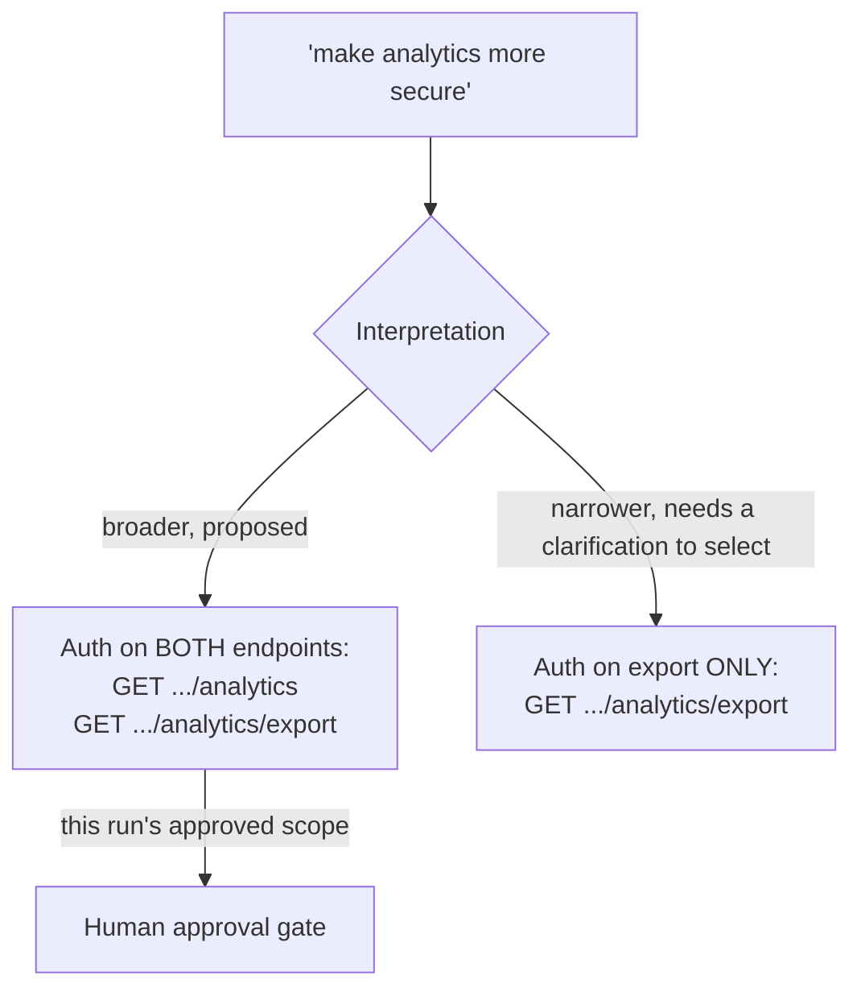

# Design: protect link analytics

## Interpreted scope — requires approval

This scenario's `architecture_design` stage requires human sign-off on the interpreted scope
above — not just on the presence of this document — because the request itself doesn't specify
which reading is correct. Approving "broad" here is a real decision a person makes, not something
the artifact-gate check can determine from content alone.

## Implementation

Reuses the same `require_auth` dependency (`service/auth.py`) the admin UI already has — no new
auth mechanism. Applying it is a one-line `dependencies=[Depends(require_auth)]` per route in
`service/routes/links.py`.

## Verification

`orchestrator/stages.py`'s `implementation_core_auth_executor` checks which scope is *currently
correct* by reading `scenarios/ambiguous/clarification.md`'s presence at the moment it runs, not
at graph-build time: absent, it checks for the broad (approved) scope; present, it checks for the
narrowed one. This is what lets a clarification arriving after an initial verification failure
change what the next attempt checks for, using the orchestration graph's existing retry
mechanism rather than a special-cased "replan" step.
