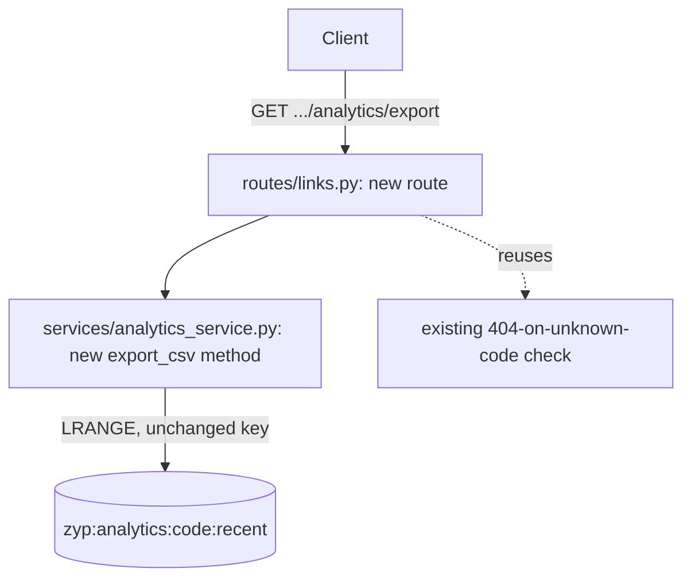

# Design: CSV export for link analytics

## Change shape

A single new read path added to the existing analytics feature, not a new subsystem:

## Implementation

`AnalyticsService.export_csv(code)` reads the same `zyp:analytics:{code}:recent` list
`get_analytics` already reads, and formats it with Python's stdlib `csv` module into an in-memory
buffer — no new dependency, no new Redis key, no change to the write path (`record_click` is
untouched). The route returns the buffer's contents as a `text/csv` response with a
`Content-Disposition: attachment` header so a browser downloads it directly.

## Safety

This stage is the one place in the codebase this scenario's orchestrator run is allowed to
modify: `service/routes` and `service/services`. If the change fails verification after retries,
the orchestrator reverts exactly those paths to the commit recorded before the stage started —
not a blanket revert of the whole working tree, and not touching any file outside what this
change was ever allowed to touch.
