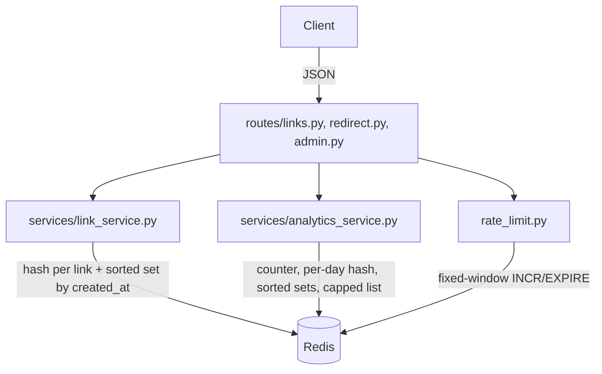

# Design: zyp

## Architecture

Three thin layers over a single Redis connection: routes (Flask + flask-smorest MethodViews) →
services (link lifecycle, analytics, rate limiting) → Redis, with no ORM or SQL layer in between.
Each service owns a small, purpose-fit set of Redis structures instead of one general-purpose
relational schema:

## Data model (Redis keys, no schema migrations)

- `zyp:link:{code}` — hash: `code`, `original_url`, `created_at`, `expires_at`, `active`.
- `zyp:links_by_created` — sorted set (score = created_at) for newest-first pagination via
  `ZREVRANGE`, replacing `ORDER BY created_at DESC LIMIT/OFFSET`.
- `zyp:code_counter` — a single `INCR`'d integer, Base62-encoded into the short code (same
  encoding sLink's `Base62Codec` uses, backed by an atomic Redis counter instead of a DB sequence).
- `zyp:analytics:{code}:total` — click counter (`INCR`).
- `zyp:analytics:{code}:by_day` — hash keyed by `YYYY-MM-DD` (`HINCRBY`).
- `zyp:analytics:{code}:referrers` / `:user_agents` — sorted sets (`ZINCRBY`) for top-N ranking.
- `zyp:analytics:{code}:recent` — a list capped at 50 entries (`LPUSH` + `LTRIM`).
- `zyp:ratelimit:{client_id}:{minute_window}` — fixed-window counter (`INCR` + `EXPIRE 60`).

## API layer

flask-smorest MethodViews per resource, with marshmallow schemas (`schemas.py`) doing validation
and response serialization from the same declaration — the same "one schema, two jobs" role
sLink's Bean Validation + DTO records play. OpenAPI/Swagger UI is generated from those schemas
automatically, not hand-written.

## Error model

RFC 7807 `problem+json` for domain errors (`LinkNotFoundError` → 404, `LinkExpiredError` → 410,
`AliasTakenError` → 409, `InvalidAliasError`/`ValueError` → 400), registered as Flask error
handlers in `errors.py`. Marshmallow's own validation-error JSON shape is left as-is rather than
forced into the same envelope — a deliberate scope cut, not an oversight.

## Testing

`tests/unit/` runs against `fakeredis` (fast, no Redis process needed) for the three services.
`tests/integration/` runs against a real local Redis (db 15, flushed around each test) through
Flask's real test client, covering the full HTTP surface including error responses, rate limiting,
and the admin UI's auth and form-submission paths.
